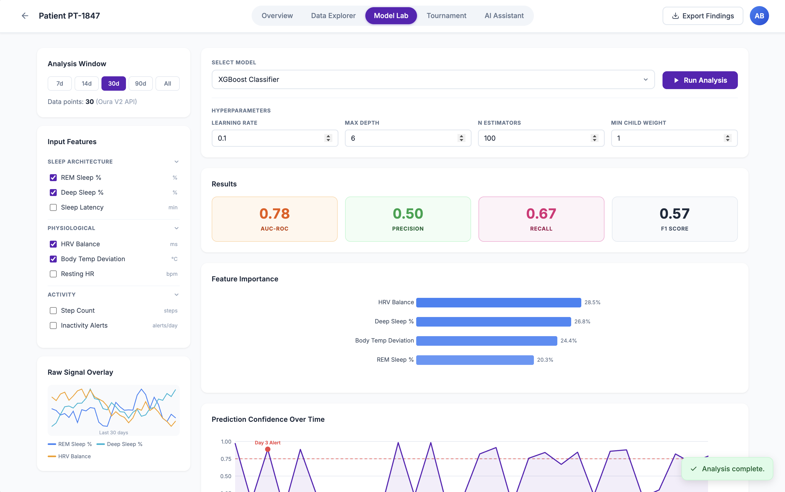

# 🏥 JupyterHealth Clinical Workbench

> **Clinician-facing web workbench for wearable + clinical data monitoring, ML disease progression prediction, and explainable AI**

A browser-based platform that enables clinical researchers to monitor patients via wearable and clinical data, run ML models for disease progression prediction, and get explainable AI rationales.

---

## [Live Demo](https://jupyterhealth-clinical-workbench.onrender.com/patient/PT-1847)

---

## Features

### Main Dashboard

- **Patient Overview Table** — View all patients with sparklines and status badges
- **Filtering** — Filter by status, data overlap, completion
- **Search** — Search patients by ID

### Patient Views

| Route               | Description                                                   |
| ------------------- | ------------------------------------------------------------- |
| **Overview**        | Biometric time series (Sleep, HRV, Activity)                  |
| **Data Explorer**   | Raw signal overlay, feature browsing                          |
| **Model Lab**       | ML model selection, training, results, feature importance     |
| **Tournament** ⚠️   | Side-by-side model comparison _(work in progress)_            |
| **AI Assistant** ⚠️ | SHAP rationale + hallucination detection _(work in progress)_ |

### Model Lab

- **Analysis Window** — 7d, 14d, 30d, 90d, All
- **Input Features** — Disease-specific feature groups (Sleep Architecture, Genetic, Biofluid, etc.)
- **Models** — XGBoost, Random Forest, LSTM, TFT
- **Results** — AUC-ROC, Precision, Recall, F1, Feature Importance
- **Saved Experiments** — Track and compare runs



### Tournament ⚠️ Work in Progress

The Tournament page allows side-by-side comparison of saved experiments for a given patient. Currently displays placeholder experiments (XGBoost, Random Forest, LSTM) with sortable AUC-ROC leaderboard and bar chart. Planned: persistent experiment storage, real trained-model results, and cross-patient comparison.

### AI Assistant ⚠️ Work in Progress

The AI Assistant tab runs a SHAP TreeExplainer pipeline on a fast XGBoost model trained on the patient's (synthetic) data, and produces a template-based clinical rationale with a confidence score. Phase 2 will replace the template rationale with a Llama 3 / GPT-4o API call.

---

## 🛠️ Tech Stack

- **Backend**: Python 3.12, Flask
- **Frontend**: HTML5, CSS3, JavaScript
- **Data**: Pandas, NumPy, Excel (xlsx)
- **ML**: scikit-learn, XGBoost, PyTorch (for TFT/LSTM)
- **Explainability**: SHAP, LIME, LLM API (Llama 3 or GPT-4o)
- **Charts**: Custom SVG in templates (no Plotly in production)
- **Deployment**: Render (free tier), Gunicorn

---

## Project Structure

```
oura-clinical-workbench/
├── app.py                           # Flask application + all routes
├── config.py                        # App-level configuration
├── requirements.txt                 # Production dependencies
├── requirements_deploy.txt         # Deployment-only dependencies
├── render.yaml                      # Render deployment config
│
├── data/                            # Data abstraction layer
│   ├── base.py                      # PatientTimeSeries dataclass + DataSource enum
│   ├── oura_adapter.py              # Oura Ring V2 API + flowsheet Excel loader
│   ├── ppmi_adapter.py              # PPMI LONI CSV loader
│   ├── synthea_adapter.py           # Synthea FHIR JSON bundle loader
│   └── feature_registry.py          # Maps data source → available features + groups
│
├── models/                          # ML model layer
│   ├── experiment.py                # Experiment config, training, result storage
│   ├── xgboost_model.py             # XGBoost wrapper
│   ├── random_forest_model.py       # Random Forest wrapper
│   ├── lstm_model.py                # LSTM/GRU temporal model
│   ├── tft_model.py                 # Temporal Fusion Transformer
│   └── explainability.py            # SHAP + LLM rationale generation
│
├── templates/                       # Jinja2 HTML templates
│   ├── base.html                    # Shared layout (nav bar, patient header)
│   ├── dashboard.html               # Main coordinator dashboard
│   ├── patient_detail.html          # Overview tab
│   ├── data_explorer.html           # Raw signal overlay
│   ├── model_lab.html               # ML model selection, training, results
│   ├── tournament.html              # Side-by-side model comparison
│   └── ai_assistant.html            # LLM explainability interface
│
├── static/                          # Static assets
│   └── style.css
│
├── demo_data/                       # Sample/demo data (safe to commit)
│   ├── demo_oura.xlsx
│   ├── demo_ppmi/
│   └── demo_synthea/
│
├── HF-Notebook/                     # Original Jupyter notebooks (exploratory)
└── tests/                           # Unit tests
```

---

## 🚀 Quick Start (Local Development)

### 1. Clone the repo

```bash
git clone https://github.com/dicristea/oura-clinical-workbench.git
cd oura-clinical-workbench
```

### 2. Create virtual environment

```bash
python -m venv venv
source venv/bin/activate  # On Windows: venv\Scripts\activate
```

### 3. Install dependencies

```bash
pip install -r requirements.txt
```

### 4. Run the app

```bash
python app.py
```

### 5. Open in browser

👉 http://localhost:5000

---

## Security Notes

⚠️ **CRITICAL for PHI/HIPAA Compliance:**

**NEVER commit:**

- `data.xlsx` (real patient PHI)
- `.env` files (API tokens, MRNs)
- Any file with real patient names, MRNs, or identifiable data
- PPMI data files downloaded from LONI (governed by DUA)

**Safe to commit:**

- `demo_data/` (synthetic/fake data only)
- `.env.example` (template with placeholder values)
- Code, templates, documentation

---

## Testing

```bash
pytest tests/
```

---

## References

- [Oura V2 API](https://cloud.ouraring.com/v2/docs)
- [PPMI](https://www.ppmi-info.org/)
- Temporal Fusion Transformers: Lim et al., 2021 (Int. J. Forecasting)
- SHAP: Lundberg & Lee, 2017 (NeurIPS)
- [OpenMHealth data standard](https://www.openmhealth.org/)

---

## License

This project handles Protected Health Information (PHI). Ensure compliance with:

- HIPAA regulations
- IRB requirements
- Data use agreements
- Patient consent requirements
